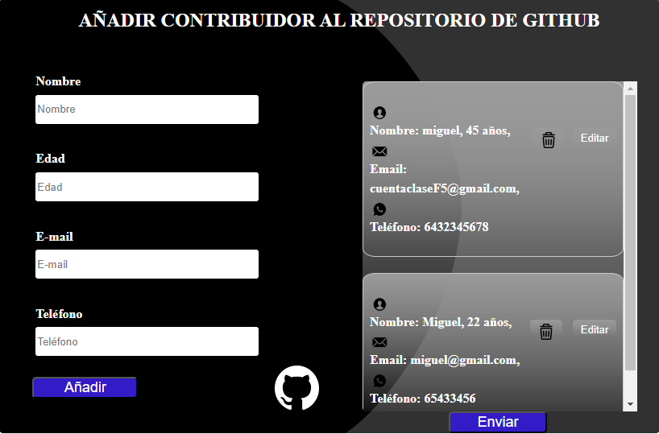
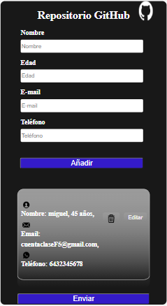

  <h1>PROYECTO TO DO LIST</h1>
 

  
Bienvenidos a nuestro  formulario  de github en el que podras añadir,editar,actualizar y borrar personas a tus  proyectos.

  
  <h2>CONTENIDO DEL PROYECTO<H2>
  
 Este proyecto es una interfaz de programación de aplicaciones (API) diseñada para llevar a cabo operaciones CRUD (Crear, Leer, Actualizar, Eliminar) en recursos específicos a través de solicitudes HTTP. Ya sea que estés construyendo una aplicación web, móvil o cualquier otra cosa, esta API proporciona las herramientas necesarias para interactuar con tus datos de manera eficiente.

  
<h2>CARACTERISTICAS DEL PROYECTO</h2>

* 
Hacer get que visualiza lo añadido 

* 
Hacer put que actualiza el contenido

* 
Hacer patch que edita usuario 

* 
Hacer delete para borrar

<h2>HEMOS UTILIZADO</h2>

HTML: Establece los atributos necesarios, como action y method en la etiqueta <form>.
CSS: Para crear el estilo.
JavaScript:  para manejar eventos del formulario, funciones  y realizar peticiones a la API. Nuestro formulario dispone de verificaciones. Al añadir caracteres que no corresponden con los datos solicitados el mismo, da error.
Dispone de alerta de error en caso de no rellenar los campos correctamente.
Dispone de validación con tick verde en caso de que el campo(input) se haya rellenado correctamente.
Event Listeners: Agrega event listeners al formulario para manejar eventos como envío (submit).

Envío de la Solicitud: fetch para enviar la solicitud a la API. Maneja la respuesta de la API, ya sea procesando los datos o manejando errores.

Al hacer click en el boton añadir, se nos añadirá el usuario en el espacio derecho o en el responsive en la parte inferior(No hay limite de usuarios.) En la versión desktop al añadir mas de 2 usuarios se nos abre el scroll en el area de almacenamiento de usuario para una experiencia mas cómoda e intuitiva.

El formulario tiene la opción de envio al correo electrónico. El mismo envia al correo de la empresa(el nuestro) la información rellenada en el formulario(no en el area de almacenamiento de usuario). Una vez rellenado el formulario, sin añadir, hacemos click en enviar, nos aparecerá la notificación de formulario enviado correctamente y en el correo recibiremos la información que se ha rellenado en el formulario de la web.

Al realizar cualquier acción, el mismo se actualiza.

Nuetro formulario esta disponible tanto en version desktop. 

Como en versión movil.

